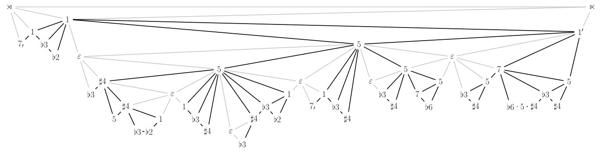

# alap-paper

Contains code to generate the figures in our [ISMIR 2019 paper on ālāp melodies](https://zenodo.org/record/3527844).
Here is an example:

To generate the tex sources for all figures, run `stack exec make-graphs`.
The generated files contain TikZ commands that can be included and styled in `tikzpicture` environments in TeX documents.
